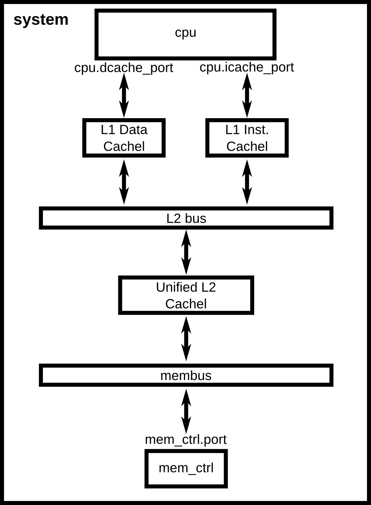

# 添加Cache

#### 1. 添加Cache后的结构

#### 2. Cache 仿真对象

Cache基础仿真对象在 ${HOME}/src/mem/cache/Cache.py 中

具体的L1 Cache，L2 Cache需要自己编写(继承Cache类)

**notice:** HOME 目录为gem5的源码目录

#### 3. 配置文件

                                                                                                                       

#### 4. Reference

[[1] gem5 book](http://learning.gem5.org/book/)